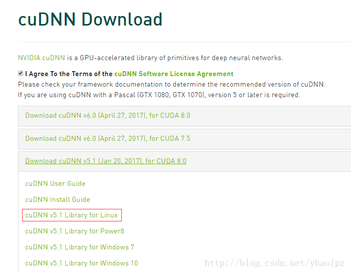
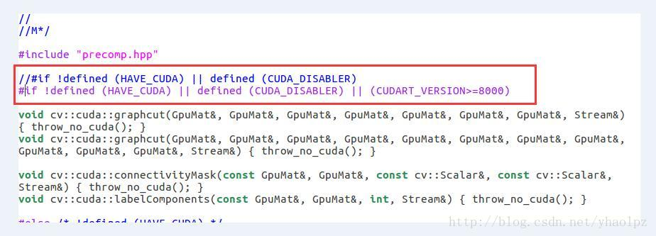

# Caffe 填坑

## 前言

由于onenote在ubuntu下糟糕的体验，所以决定转投MD来写一些技术博客，主要还是为了记录下自己在学习过程中遇到的问题，方便以后复查。

## 安装编译

软件：ubuntu14 + cuda8.0+opencv3.1.0

硬件：intel 5 + NVIDIA 1050M

### 第一步 安装依赖包

#### 安装依赖包

```
sudo apt-get install libprotobuf-dev libleveldb-dev libsnappy-dev libopencv-dev libhdf5-serial-dev protobuf-compiler

sudo apt-get install --no-install-recommends libboost-all-dev

sudo apt-get install libopenblas-dev liblapack-dev libatlas-base-dev

sudo apt-get install libgflags-dev libgoogle-glog-dev liblmdb-dev

sudo apt-get install git cmake build-essential

```

其中 boost包推荐使用源码编译安装。由于caffe对于boost版本的要求是至少大于等于1.55，这里系统很可能给你安装一个1.54的。所以推荐使用源码安装。

#### boost包源码编译安装

1、查看本机boost版本

```
dpkg -S /usr/include/boost/version.hpp
```

2、删除已有boost文件

```
sudo apt-get autoremove libboost1.54-dev
```

​	如果是1.55的话改以下数字就行。

```
sudo rm -f /usr/local/lib/libboost* 
sudo rm -r /usr/local/include/boost
```

3、下载Boost库

```
wget https://dl.bintray.com/boostorg/release/1.66.0/source/boost_1_66_0.tar.gz
```

4、解压以后运行脚本编译​	

```
cd boost_1_66_0
./bootstrap.sh
./b2 install
ldconfig -v
```

5、测试

​	创建一个新文件，命名为test.cpp：

```c++
#include <boost/thread/thread.hpp>
#include <iostream>
using namespace boost;

void test()
{
    std::cout<<"hello world!"<<std::endl;
}
int main(int argc, char const *argv[]) {
    boost::thread  t1(&test);
    t1.join();
    return 0;
}
```

​	编译命令

```
g++ test.cpp -lboost_system -lboost_thread -lboost_filesystem -lpthread -o test
```

​	执行

```
./test
```

​	出现 “hello world！”，证明成功。


### 第二步 安装cuda8.0


[参考链接]: https://blog.csdn.net/masa_fish/article/details/51882183

​	

### 第三步 安装cudnn

​	登录官网<https://developer.nvidia.com/rdp/cudnn-download>，下载对应cnDNN包，这里选择 v5.1的安装包。



下载完成后解压，得到一个 cudn 文件夹，该文件夹下include 和 lib64 两个文件夹，命令行进入 cudn/include 路径下，然后进行以下操作：

```
sudo cp cudnn.h /usr/local/cuda/include/ #复制头文件
```

然后命令行进入 cudn/lib64 路径下，运行以下命令

```
sudo cp lib* /usr/local/cuda/lib64/ #复制动态链接库
cd /usr/local/cuda/lib64/sudo rm -rf libcudnn.so libcudnn.so.5 #删除原有动态文件
sudo ln -s libcudnn.so.5.1.10 libcudnn.so.5 #生成软衔接
sudo ln -s libcudnn.so.5 libcudnn.so #生成软链接
```

安装完成后可用 nvcc -V 命令验证是否安装成功，若出现以下信息则表示安装成功：

```
yhao@yhao-X550VB:~$ nvcc -V
nvcc: NVIDIA (R) Cuda compiler driver
Copyright (c) 2005-2016 NVIDIA Corporation
Built on Tue_Jan_10_13:22:03_CST_2017
Cuda compilation tools, release 8.0, V8.0.61
```

### 第四步 安装opencv3.1

进入官网<http://opencv.org/releases.html>，下载对应源码包。

由于3.1与cuda8.0不兼容，解决办法：

修改文件/opencv-3.1.0/modules/cudalegacy/src/graphcuts.cpp



然后编译：

```
mkdir build # 创建编译的文件目录

cd build

cmake -D CMAKE_BUILD_TYPE=Release -D CMAKE_INSTALL_PREFIX=/usr/local/opencv/3.1.0 ..

make -j8  #编译
```

然后安装：

```
sudo make install #安装
```

安装完成后通过查看 opencv 版本验证是否安装成功：

```
pkg-config --modversion opencv 
```

### 第五步 安装caffe

首先在你要安装的路径下 clone ：

```
git clone https://github.com/BVLC/caffe.git
```

进入 caffe ，将 Makefile.config.example 文件复制一份并更名为 Makefile.config ，也可以在 caffe 目录下直接调用以下命令完成复制操作 ：

```
sudo cp Makefile.config.example Makefile.config
```

复制一份的原因是编译 caffe 时需要的是 Makefile.config 文件，而Makefile.config.example 只是caffe 给出的配置文件例子，不能用来编译 caffe。

然后修改 Makefile.config 文件，在 caffe 目录下打开该文件：

```
sudo gedit Makefile.config
```

修改 Makefile.config 文件内容

1、应用cudnn

```
将
#USE_CUDNN := 1
修改成： 
USE_CUDNN := 1
```

2、应用opencv版本

```
将
#OPENCV_VERSION := 3 
修改为： 
OPENCV_VERSION := 3
```

3、使用python接口

```
将
#WITH_PYTHON_LAYER := 1 
修改为 
WITH_PYTHON_LAYER := 1
```

4、修改python路径

```
INCLUDE_DIRS := $(PYTHON_INCLUDE) /usr/local/include
LIBRARY_DIRS := $(PYTHON_LIB) /usr/local/lib /usr/lib 
修改为
# Whatever else you find you need goes here.
INCLUDE_DIRS := $(PYTHON_INCLUDE) /usr/local/opencv/3.1.0/include /usr/local/include
LIBRARY_DIRS := $(PYTHON_LIB) /usr/local/opencv/3.1.0/lib /usr/local/lib /usr/lib
```

然后修改caffe目录下的Makefile文件：

```
将：
NVCCFLAGS +=-ccbin=$(CXX) -Xcompiler-fPIC $(COMMON_FLAGS)
替换为：
NVCCFLAGS += -D_FORCE_INLINES -ccbin=$(CXX) -Xcompiler -fPIC $(COMMON_FLAGS)
```

然后修改 /usr/local/cuda/include/host_config.h 文件 :

```
将
#error-- unsupported GNU version! gcc versions later than 4.9 are not supported!
改为
//#error-- unsupported GNU version! gcc versions later than 4.9 are not supported!
```

在 caffe 目录下执行 ：

```
make all -j8
```

编译成功后可运行测试：

```
sudo make runtest -j8
```

### 第六步 安装pycaffe notebook接口环境

在上一步成功安装caffe后，其实就完成了caffe的安装。只不过要在命令行下通过caffe命令操作，而这一步用python来实现可视化操作。

首先编译 pycaffe :

```
cd caffe
sudo make pycaffe -j8
```

以下是我编译 pycaffe 时出现的错误：

```
python/caffe/_caffe.cpp:10:31: fatal error: numpy/arrayobject.h: 没有那个文件或目录
```

解决方法

```
sudo apt-get install python-numpy
```

编译 pycaffe 成功后，验证一下是否可以在 python 中导入 caffe 包，首先进入 python 环境

```
python
```

然后导入caffe：

```
>>> import caffe
```

若不报错则表示 caffe 的 python 接口已正确编译，但是应该不会那么顺利，以下是我导入 caffe 时出现的错误：

```
File "<stdin>", line 1, in <module>   ImportError: No module named caffe
```

解决方法：

```
sudo echo export PYTHONPATH="~/caffe/python" >> ~/.bashrc

source ~/.bashrc
```

错误2：

```
ImportError: No module named skimage.io
```

解决方法：

```
sudo pip install -U scikit-image #若没有安装pip: sudo apt install python-pip
```

注意pip下载过慢会报错，调整好网络再重新下载


安装过程中出现如下问题：

```
 RuntimeError: Cython >= 0.23.4 is required to build scikit-image from git checkout
```

解决办法：

```
sudo pip install Cython
```

又报错：

```
Make sure you have pip >= 9.0.1
```

更新pip：

```
 sudo python -m pip uninstall pip
 sudo python -m pip  install --upgrade pip
```

还是有问题，于是考虑apt方式引入包：

```
sudo apt-get install python-numpy python-scipy python-matplotlib python-sklearn python-skimage 
	python-h5py python-protobuf python-leveldb python-networkx python-nose python-pandas python-gflags 
	Cython ipython
	
sudo apt-get install python-protobuf
	
sudo apt-get update
```

验证：

```
python
>>import caffe
```

不报错说明成功了


### 第七步 配置notebook环境

首先要安装python接口依赖库，在caffe根目录的python文件夹下，有一个requirements.txt的清单文件，上面列出了需要的依赖库，按照这个清单安装就可以了。

在安装scipy库的时候，需要fortran编译器（gfortran)，如果没有这个编译器就会报错，因此，我们可以先安装一下。

首先进入 caffe/python 目录下，执行安装代码：

```
sudo apt-get install gfortran

for req in $(cat requirements.txt); do sudo pip install $req; done
```

安装完成以后执行：

```
sudo pip install -r requirements.txt
```

就会看到，安装成功的，都会显示Requirement already satisfied, 没有安装成功的，会继续安装。

出现一个问题：

```
 ImportError: Tornado requires an up-to-date SSL module. This means Python 2.7.9+ or 3.4+ (although some distributions have backported the necessary changes to older versions).
```

解决方法：

```
sudo pip install tornado==4.1
```

然后安装 jupyter ：

```
sudo pip install jupyter
```

安装完成后运行 notebook :

```
jupyter notebook

或

ipython notebook
```

出现以下错误：

```
Traceback (most recent call last):
  File "/usr/local/bin/jupyter-notebook", line 11, in <module>
    sys.exit(main())
  File "/usr/local/lib/python2.7/dist-packages/jupyter_core/application.py", line 266, in launch_instance
    return super(JupyterApp, cls).launch_instance(argv=argv, **kwargs)
  File "/usr/local/lib/python2.7/dist-packages/traitlets/config/application.py", line 657, in launch_instance
    app.initialize(argv)
  File "<decorator-gen-7>", line 2, in initialize
  File "/usr/local/lib/python2.7/dist-packages/traitlets/config/application.py", line 89, in catch_config_error
    app.print_help()
  File "/usr/local/lib/python2.7/dist-packages/traitlets/config/application.py", line 385, in print_help
    self.print_subcommands()
  File "/usr/local/lib/python2.7/dist-packages/traitlets/config/application.py", line 377, in print_subcommands
    print(os.linesep.join(lines))
UnicodeDecodeError: 'ascii' codec can't decode byte 0xe5 in position 4: ordinal not in range(128)

```

在jupyter的官网上找到了答案，原来是安装的命令不对，或者说jupyter最标准的安装应该是批python3环境安装，网上有很多安装步骤都是用Python安装的，根本就不行。

解决方法：

```
sudo python3 -m pip install --upgrade pip

sudo python3 -m pip install jupyter
```

再运行：

```
jupyter notebook

或

ipython notebook
```

成功。