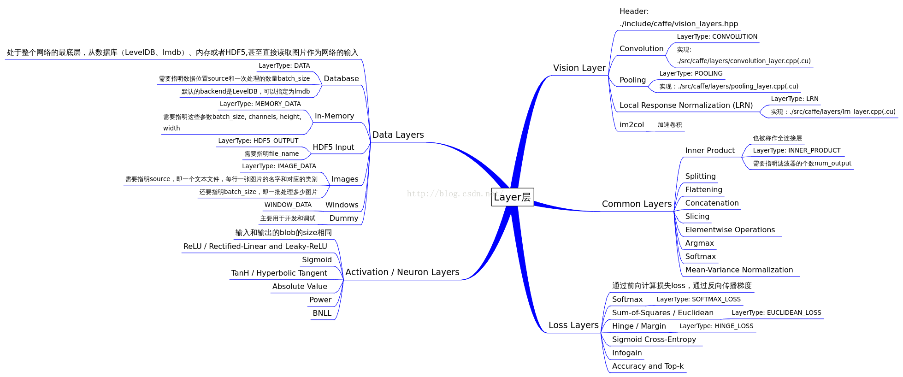
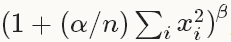
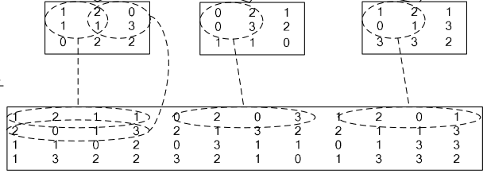
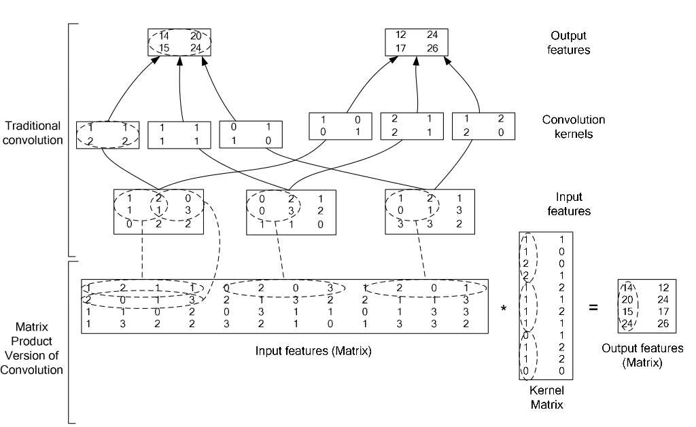

# caffe的layer层学习

参考文献：https://blog.csdn.net/u014114990/article/details/47440565

## layer层

### 1、介绍

Caffe十分强调网络的层次性，数据输入，卷积，非线性变换（ReLU等），网络连接，损失函数计算等等操作都由一个layer来实现。layer是网络的基本单元，由此派生出各种层类。

层和层参数定义在src/caffe/proto/caffe.proto文件中。编译之后产生 .pb.cc和一个pb.h的文件。在neuron_layers.hpp、data_layer.hpp、vision_layers.hpp、common_layers.hpp、loss_layers.hpp这5大类层头文件都有调用，可以把prototxt中每层的配置参数读入到配置网络的每一层的程序中。

### 2、layer.hpp抽象基类介绍

Layer.hpp时所有layer的相关头文件，是抽象基类。

主要的3个参数：

- layer_param_ 是protobuf文件中存储的layer参数
- blobs_存储layer的参数，在程序中用的
- param_propagate_down_   bool类型，用来表示是否计算各个blob参数的diff，即传播误差。

主要的3个函数：

- SetUp（） 根据实际的参数设置进行实现，对各种类型的参数初始化；
- Forward（）和Backward（），对应前向计算和反向更新，输入统一都是bottom，输出为top，其中Backward里面的propagate_down参数，用来表示该Layer是否反向传播参数。

Layer中程序框架可以通过以下图片简单了解：




（1）数据层

Data层为数据输入层，头文件定义 src/caffe/include/caffe/data_layer.hpp中，作为网络的最底层，主要实现数据输入和格式的转换。

（2）神经元层

Neuron层为元素级别运算层，头文件定义在 src/caffe/include/caffe/neuron_layers.hpp 中，其派生类主要是元素级别的运算（比如 Dropout 运算，激活函数ReLu，Sigmoid等）

（3）特征表达层

Vision层为图像卷积相关层，头文件定义在 src/caffe/include/caffe/vision_layers.hpp 中，像convolusion、pooling、LRN都在里面。

（4）网络连接层

Common层为网络连接层，头文件定义在 src/caffe/include/caffe/common_layer.hpp中。Caffe提供了单个层获多个层的连接，并在这个头文件中声明。包括了常用的全连接层 innerProductLayer类。

（5）损失函数层

Loss层为损失函数层，头文件定义在 src/caffe/include/caffe/loss_layers.hpp 中。前面的data layer 和 common layer 都是中间计算层，虽然会涉及到反向传播，但传播的源头来自于loss_layer,即网络的最终端。这一层因为要计算误差，所以输入都是2个blob，输出1个blob。

总之，data负责输入，vision负责卷积相关的计算，neuron和common负责中间部分的数据计算，而loss时最后一部分，负责计算反向传播的误差。具体的实现都在src/caffe/layers里面。


## Data数据层

类型，type ： Data

必须参数：

- source：包含数据的目录名称
- batch_size：一次处理的输入数量

可选参数：

- rand_skip：在开始的时候从输入中跳过这个数值，这在异步随机梯度（SGD）的时候非常有用。
- Backend：默认LEVELDB，选择使用LEVELDB或者LMDB。

```
layer {
  name: "mnist"
  type: "Data"
  top: "data"
  top: "label"
  include {
    phase: TRAIN
  }
  transform_param {
    scale: 0.00390625
    mean_file_size: "examples/cifar10/mean.binaryproto"
    # 用一个配置文件来进行均值操作
    mirror: 1  # 1表示开启镜像，0表示关闭，也可用ture和false来表示
    # 剪裁一个 227*227的图块，在训练阶段随机剪裁，在测试阶段从中间裁剪
    crop_size: 227
  }
  data_param {
    source: "examples/mnist/mnist_train_lmdb"
    batch_size: 64
    backend: LMDB
  }
}

```

其中transform_param：数据的预处理，可以将数据变换到定义的范围内。如 scale：0.00390625实际上就是1/255 ，即将输入数据由0-255归一化到0-1。


应用网络时，数据层变成input层

type:Input

input参数：输入数据的维数。

```
layer {
  name: "data"
  type: "Input"
  top: "data"
  input_param {
    shape {
      dim: 1
      dim: 3
      dim: 28
      dim: 28
    }
  }
}
```


## neuron神经元层

类型 ： ReLU

```

```


## common网络连接层

common层为复杂数据运算层。

类型：InnerProduct

必要参数：num_output(c_o):输出神经元的个数

可选参数：

- weight_filler[default type:'constant' value:0]：权值初始化，一般是高斯。
- bias_filler[default type:'constant' value:0]：默认


## VISION层

### 1、Convolution层

类型：Convolution

参数：

- lr_mult：学习率系数，会乘以solver.prototxt 配置文件中的base_lr。如果有两个，第一表示权的，第二个表示偏置项的。一般偏置项的学习是权的两倍。

卷积参数：

- num_output:卷积核的个数。
- kernel_size：卷积核的大小。如果卷积核的长和宽不等，需要用kernel_h和kernel_w分别设定。

可选参数：

- stride：卷积核步长，默认为1。
- pad：边缘补充。默认为0。
- weight_filler:权值初始化。默认constant，全是0。 设置为gaussian
- bias_filler:偏置项的初始化。一般设置为constant，值全为0。
- bias_term：是否开启权值项。默认 true。
- group：分组。默认是1组。如果大于1，我们限制卷积的连接操作在一个子集内。如果我们根据图像的通道来分组，那么第i个输出分组只能与第i个输入分组进行连接。

```
layer {
  name: "conv1"
  type: "Convolution"
  bottom: "data"
  top: "conv1"
  param {
    lr_mult: 1
  }
  param {
    lr_mult: 2
  }
  convolution_param {
    num_output: 20
    kernel_size: 5
    stride: 1
    weight_filler {
      type: "xavier"
    }
    bias_filler {
      type: "constant"
    }
  }
}
```

### 2、Pooling层

类型：Pooling

pooling参数：

- kernel_size: 池化的核大小。也可以用kernel_h和kernel_w分别设定。

可选参数：

- stride：卷积核步长，默认为1。
- pad：边缘补充。默认为0。
- pool: 池化方法，默认为MAX。目前可用的方法有MAX, AVE, 或STOCHASTIC

```
layer {
  name: "pool1"
  type: "Pooling"
  bottom: "conv1"
  top: "pool1"
  pooling_param {
    pool: MAX
    kernel_size: 3
    stride: 2
  }
}
```

### 3、LRN层

类型：LRN

lrn参数：

可选参数：

- local_size: 默认为5。如果是跨通道LRN，则表示求和的通道数；如果是在通道内LRN，则表示求和的正方形区域长度。
- alpha: 默认为1，归一化公式中的参数。
- beta: 默认为5，归一化公式中的参数。
- norm_region: 默认为ACROSS_CHANNELS。有两个选择，ACROSS_CHANNELS表示在相邻的通道间求和归一化。WITHIN_CHANNEL表示在一个通道内部特定的区域内进行求和归一化。与前面的local_size参数对应。

归一化公式：对于每一个输入, 去除以

，得到归一化后的输出

```
layers {
  name: "norm1"
  type: LRN
  bottom: "pool1"
  top: "norm1"
  lrn_param {
    local_size: 5
    alpha: 0.0001
    beta: 0.75
  }
}
```

### 4、im2col层

它先将一个大矩阵，重叠地划分为多个子矩阵，对每个子矩阵序列化成向量，最后得到另外一个矩阵。



在caffe中，卷积运算就是先对数据进行im2col操作，再进行内积运算（inner product)。这样做，比原始的卷积操作速度更快。

看看两种卷积操作的异同：




## 损失函数层

## softmax

 类型：SoftmaxWithLoss（广义线性回归分析损失层）

Softmax Loss Layer计算的是输入的多项式回归损失（multinomial logistic loss of the softmax of its inputs）。可以当作是将一个softmax layer和一个multinomial logistic loss layer连接起来，但是计算出的gradient更可靠。

```
layer {
  name: "prob"
  type: "SoftmaxWithLoss"
  bottom: "ip2"  #全连接层的输出
  bottom: "label" #数据层的label，在这里做差
  top: "loss"
}
```

类型：Softmax（用于计算单副影像时，即预测时）

```
layer {
  name: "prob"
  type: "Softmax"
  bottom: "ip2"
  top: "prob"
}

```

## 精度层

仅用在测试时，跟在loss层后

```
layer {
  name: "accuracy"
  type: "Accuracy"
  bottom: "ip2"
  bottom: "label"
  top: "accuracy"
}
```

