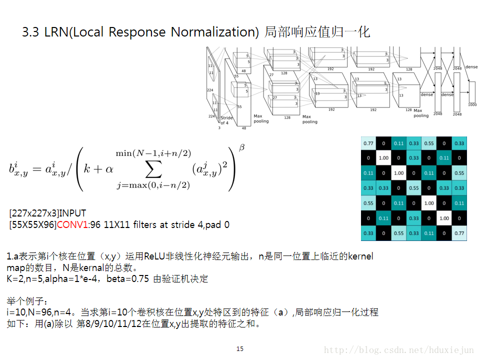

# 网络结构

## 整体网络结构

输入层：input layer

卷积层：conv layer

池化层：pool layer

规范层：norm layer    规范化输入

激活函数：type of activation function

全连接层：fc layer(fully connect layer)

drop out 层：防止过拟合(dropout layer)

概率输出层：prob layer (probability output layer)

### 输入层 （input layer）

​	参数：

- batch size： 训练是用随机梯度下降的方式进行，但是每次输入的是一批数据，而不是一个数据。
- channel：通道数
- image width：图像宽
- image height：图像高

### 卷积层 （conv layer）

​	参数：

- num of kernels (num of output)：卷积核数量，有多少核就代表一幅图像会卷积后会出现多少层，对应上面就是几个通道。每个通道都是由不同卷积核卷积得到的。

- kernel size：卷积核大小

- stride：步长

- pad：对图像边缘的补充

- group：caffe Convolution层的convolution_param参数字典中有一个group参数，其意思是将对应的输入通道与输出通道数进行分组，比如输入数据大小为90x100x100x32 90是数据批大小 100x100是图像数shape，32是通道数，要经过一个3x3x48的卷积，group默认是1，就是全连接的卷积层，

  如果group是2，那么对应要将输入的32个通道分成2个16的通道，将输出的48个通道分成2个24的通道。对输出的2个24的通道，第一个24通道与输入的第一个16通道进行全卷积，第二个24通道与输入的第二个16通道进行全卷积。极端情况下，输入输出通道数相同，比如为24，group大小也为24，那么每个输出卷积核，只与输入的对应的通道进行卷积。

### 池化层 （pool layer）

​	参数：

​		pooling type： 池化方式（max pooling）

​		kernel size： 核大小

​		stride：步长

### 规范层 （norm layer） 

通常在池化层后，激活函数前。

以 Local Response Normalization 为例。

https://www.youtube.com/watch?v=BZh1ltr5Rkg&t=21s

​	参数：

​		LRN norm：局部响应归一化

- 局部归一化的动机：神经元的侧抑制现象。指的是被激活的神经元抑相邻神经元。归一化的目的是“抑制”。
- 好处：有利于增加范化能力，做了平滑处理，识别率提高1~2%

​		local size ：n 同一位置上临近的kernel map的数目

​		alpha： 局部响应归一化的超参数，一般设 1×e-4

​		beta：局部响应归一化的超参数，一般设 0.75

### 激活函数 （activation function）

​	参数：

​		类型：reLu

### 全连接层 （fully connect layer）

​	参数：

​		类型：InnerProduct

​		num of output：

### drop layer (dropout layer)

​	防止过拟合。

​	参数：

​		dropout ratio

### 概率输出层 （probability output layer）

​	参数：

​		类型：soft max

## 网络权值

网络权值, 除了网络固定的参数, 比如: num of kernel, stride, pad, group, * ratio 等等. 网络权重是网络训练最终得到的非固定的参数, 也就是所有"核"的最终形态. 包括:

1. 卷积层的卷积核.
2. 全连接层的连接权重.

**==（暂时先这样）==**