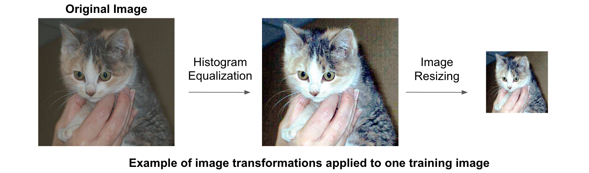

# Caffe训练一个CNN神经网络

在caffe中训练CNN主要以下四个步骤：

1. 数据准备：需要将图片重新存储为Caffe能够使用的类型。Caffe是在数据库中调用的图像。
2. 定义模型：选择一个CNN的结构并且在配置文件中定义它的参数。Caffe中以 .prototxt 扩展名定义。
3. 定义求解器：求解器负责模型的优化。同样的，我们在 .prototxt 文件中定义求解器的配置。
4. 模型训练：我们通过执行Caffe的命令行操作来训练一个模型。训练之后，这个模型会以 .caffemodel 的扩展名形式被保存。

训练阶段之后，我们将使用 .caffemodel 来预测新的未知数据（test模型）。

==本文以阿猫阿狗的训练数据为例，来实现caffe的完整使用过程。==

### 数据预处理

​	首先，我们下载阿猫阿狗的训练、测试数据 

​	https://www.kaggle.com/c/dogs-vs-cats

​	然后下载大神的代码

​	https://github.com/adilmoujahid/deeplearning-cats-dogs-tutorial.git


​	在deeplearning-cats-dogs-tutorial文件夹中创建input文件夹，把阿猫阿狗数据放进去。

​	然后我们运行 create_lmdb.py ，就是把现有的图像数据以数据库的形式存储起来，这个文件就是实现格式转换的。​	

```
cd ~/deeplearning-cats-dogs-tutorial/code
python create_lmdb.py
```

其中，create_lmdb.py文件完成了以下工作：

- 在所有训练图像上运行直方图均衡化。直方图均衡化是一项用来调整图像对比度的技术。
- 把所有图像的大小调整为227x227
- 把训练图像划分为两个子集：一个用于训练（5/6），一个用于验证（1/6）。训练集用于训练模型，验证集用于计算模型精度。
- 存储训练和验证集到两个LMDB数据库中。分别命名为train_lmdb 和 validation_lmdb。

以下对代码最重要的部分做解释：

```python
def transform_img(img, img_width=IMAGE_WIDTH, img_height=IMAGE_HEIGHT):

    #Histogram Equalization
    img[:, :, 0] = cv2.equalizeHist(img[:, :, 0])
    img[:, :, 1] = cv2.equalizeHist(img[:, :, 1])
    img[:, :, 2] = cv2.equalizeHist(img[:, :, 2])

    #Image Resizing
    img = cv2.resize(img, (img_width, img_height), interpolation = cv2.INTER_CUBIC)

    return img
```

transform_img 函数把一个彩色图像作为输入，对三通道的颜色做直方图均衡化以及重新调整图像大小。



```python
def make_datum(img, label):
    #image is numpy.ndarray format. BGR instead of RGB
    return caffe_pb2.Datum(
        channels=3,
        width=IMAGE_WIDTH,
        height=IMAGE_HEIGHT,
        label=label,
        data=np.rollaxis(img, 2).tostring())

```

make_datum 输入时一个影像和它的标记并且返回一个 Datum object ，这其中包括了图像和它的标记。


```python
in_db = lmdb.open(train_lmdb, map_size=int(1e12))
with in_db.begin(write=True) as in_txn:
    for in_idx, img_path in enumerate(train_data):
        if in_idx %  6 == 0:
            continue
        img = cv2.imread(img_path, cv2.IMREAD_COLOR)
        img = transform_img(img, img_width=IMAGE_WIDTH, img_height=IMAGE_HEIGHT)
        if 'cat' in img_path:
            label = 0
        else:
            label = 1
        datum = make_datum(img, label)
        in_txn.put('{:0>5d}'.format(in_idx), datum.SerializeToString())
        print '{:0>5d}'.format(in_idx) + ':' + img_path
in_db.close()
```

上述代码使用5/6的训练图像，变换并存储他们在train_lmdb。验证数据也是以上述结构来修改并保存的。

==为训练数据生成一个均值图像==

执行以下操作来生成一个训练数据的均值图像。我们将把所有图像减去这个均值图像以保证每个特征像素有一个0均值。这是一个在监督分类中常规的预处理步骤。

```
/home/ubuntu/caffe/build/tools/compute_image_mean -backend=lmdb /home/ubuntu/deeplearning-cats-dogs-tutorial/input/train_lmdb /home/ubuntu/deeplearning-cats-dogs-tutorial/input/mean.binaryproto
```

### 模型定义

​	在决定了CNN结构以后，我们需要以 .prototxt 为扩展的文件 train_val 定义参数。Caffe有许多流行的CNN模型，例如Alexnet 和GoogleNet。在这个教程中，我们使用 bvlc_reference_caffenet 模型，他是AlexNet的一个变种。网络参数在文件 train_val.prototxt 中。

