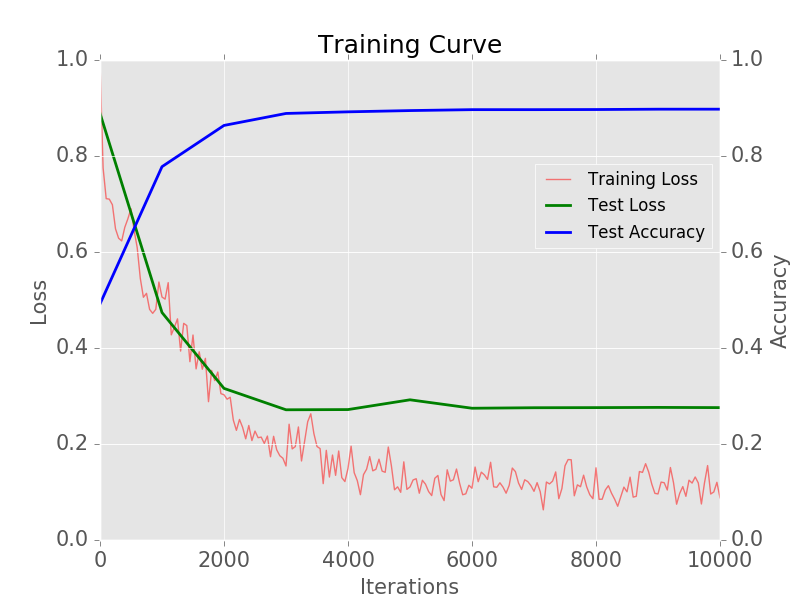
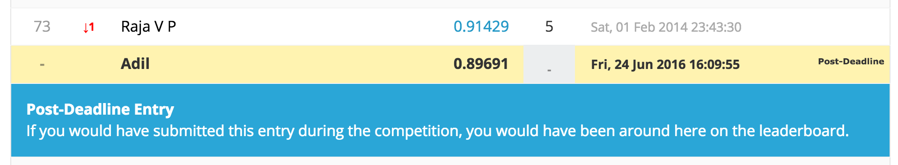

# Caffe训练一个CNN神经网络

参考文章：[A Practical Introduction to Deep Learning with Caffe and Python](http://adilmoujahid.com/posts/2016/06/introduction-deep-learning-python-caffe/)

在caffe中训练CNN主要以下四个步骤：

1. 数据准备：需要将图片重新存储为Caffe能够使用的类型。Caffe是在数据库中调用的图像。
2. 定义模型：选择一个CNN的结构并且在配置文件中定义它的参数。Caffe中以 .prototxt 扩展名定义。
3. 定义求解器：求解器负责模型的优化。同样的，我们在 .prototxt 文件中定义求解器的配置。
4. 模型训练：我们通过执行Caffe的命令行操作来训练一个模型。训练之后，这个模型会以 .caffemodel 的扩展名形式被保存。

训练阶段之后，我们将使用 .caffemodel 来预测新的未知数据（test模型）。

==本文以阿猫阿狗的训练数据为例，来实现caffe的完整使用过程。==

### 数据预处理

​	首先，我们下载阿猫阿狗的训练、测试数据 

​	https://www.kaggle.com/c/dogs-vs-cats

​	然后下载大神的代码

​	https://github.com/adilmoujahid/deeplearning-cats-dogs-tutorial.git


​	在deeplearning-cats-dogs-tutorial文件夹中创建input文件夹，把阿猫阿狗数据放进去。

​	然后我们运行 create_lmdb.py ，就是把现有的图像数据以数据库的形式存储起来，这个文件就是实现格式转换的。​	

```
cd ~/deeplearning-cats-dogs-tutorial/code
python create_lmdb.py
```

其中，create_lmdb.py文件完成了以下工作：

- 在所有训练图像上运行直方图均衡化。直方图均衡化是一项用来调整图像对比度的技术。
- 把所有图像的大小调整为227x227
- 把训练图像划分为两个子集：一个用于训练（5/6），一个用于验证（1/6）。训练集用于训练模型，验证集用于计算模型精度。
- 存储训练和验证集到两个LMDB数据库中。分别命名为train_lmdb 和 validation_lmdb。

以下对代码最重要的部分做解释：

```python
def transform_img(img, img_width=IMAGE_WIDTH, img_height=IMAGE_HEIGHT):

    #Histogram Equalization
    img[:, :, 0] = cv2.equalizeHist(img[:, :, 0])
    img[:, :, 1] = cv2.equalizeHist(img[:, :, 1])
    img[:, :, 2] = cv2.equalizeHist(img[:, :, 2])

    #Image Resizing
    img = cv2.resize(img, (img_width, img_height), interpolation = cv2.INTER_CUBIC)

    return img
```

transform_img 函数把一个彩色图像作为输入，对三通道的颜色做直方图均衡化以及重新调整图像大小。


```python
def make_datum(img, label):
    #image is numpy.ndarray format. BGR instead of RGB
    return caffe_pb2.Datum(
        channels=3,
        width=IMAGE_WIDTH,
        height=IMAGE_HEIGHT,
        label=label,
        data=np.rollaxis(img, 2).tostring())

```

make_datum 输入时一个影像和它的标记并且返回一个 Datum object ，这其中包括了图像和它的标记。


```python
in_db = lmdb.open(train_lmdb, map_size=int(1e12))
with in_db.begin(write=True) as in_txn:
    for in_idx, img_path in enumerate(train_data):
        if in_idx %  6 == 0:
            continue
        img = cv2.imread(img_path, cv2.IMREAD_COLOR)
        img = transform_img(img, img_width=IMAGE_WIDTH, img_height=IMAGE_HEIGHT)
        if 'cat' in img_path:
            label = 0
        else:
            label = 1
        datum = make_datum(img, label)
        in_txn.put('{:0>5d}'.format(in_idx), datum.SerializeToString())
        print '{:0>5d}'.format(in_idx) + ':' + img_path
in_db.close()
```

上述代码使用5/6的训练图像，变换并存储他们在train_lmdb。验证数据也是以上述结构来修改并保存的。

==为训练数据生成一个均值图像==

执行以下操作来生成一个训练数据的均值图像。我们将把所有图像减去这个均值图像以保证每个特征像素有一个0均值。这是一个在监督分类中常规的预处理步骤。

```
/home/ubuntu/caffe/build/tools/compute_image_mean -backend=lmdb /home/ubuntu/deeplearning-cats-dogs-tutorial/input/train_lmdb /home/ubuntu/deeplearning-cats-dogs-tutorial/input/mean.binaryproto
```

### 模型定义

​	在决定了CNN结构以后，我们需要以 .prototxt 为扩展的文件 train_val 定义参数。Caffe有许多流行的CNN模型，例如Alexnet 和GoogleNet。在这个教程中，我们使用 bvlc_reference_caffenet 模型，他是AlexNet的一个变种。网络参数在文件 train_val.prototxt 中。

我们需要对 .prototxt 文件做以下修改：

- 改变输入数据和均值图像的路径：第 24 ， 40 ， 51 行。
- 改变输出的数量，从1000变到2：第373行。原始的 bvlc_reference_caffenet 被设计用来分1000类。

我们能够执行以下命令来打印网络结构。模型结构将被存储在：

deeplearning-cats-dogs-tutorial/caffe_models/caffe_model_1/caffe_model_1.png

```
python /home/ubuntu/caffe/python/draw_net.py /home/ubuntu/deeplearning-cats-dogs-tutorial/caffe_models/caffe_model_1/caffenet_train_val_1.prototxt /home/ubuntu/deeplearning-cats-dogs-tutorial/caffe_models/caffe_model_1/caffe_model_1.png
```

### 定义求解器

求解器负责模型优化。我们定义求解器参数在一个 .prototxt 文件中。你能在以下目录找到它：

deeplearning-cats-dogs-tutorial/caffe_models/caffe_model_1/solver_1.prototxt

这个求解器每1000此迭代使用验证集计算模型的精度。优化过程将执行40000的最大迭代，每5000次迭代拍个快照。

base_lr，lr_policy，gamma，momentum 和 weight_decay 是超参数，我们需要调节他们让模型收敛。

这里选择 lr_policy:"step" 同时 stepsize:2500，base_lr：0.001以及gamma：0.1。在这样的配置下，我们将开始的学习速率设置为0.001，并且我们将用一个因素在每2500次迭代时降低学习速率。

有不同的优化策略，如果想具体了解，推荐caffe的求解器文档：http://caffe.berkeleyvision.org/tutorial/solver.html


### 模型训练

在定义了模型和求解器之后，我们能通过执行以下命令来开始训练模型：

```
/home/ubuntu/caffe/build/tools/caffe train --solver /home/ubuntu/deeplearning-cats-dogs-tutorial/caffe_models/caffe_model_1/solver_1.prototxt 2>&1 | tee /home/ubuntu/deeplearning-cats-dogs-tutorial/caffe_models/caffe_model_1/model_1_train.log
```

后面的参数代表训练的日志文件。

训练时遇到以下问题：

```
E1018 09:50:57.036653 10384 common.cpp:114] Cannot create Cublas handle. Cublas won't be available.
F1018 09:50:58.227605 10384 benchmark.cpp:112] Check failed: error == cudaSuccess (30 vs. 0)  unknown error
```

解决办法：在root下执行命令，且保持环境变量不变：

```
sudo --preserve-env
```

训练时遇到以下问题：

```
Check failed: error == cudaSuccess (2 vs. 0)  out of memory
```

分析：

你得到的错误确实是内存不足，但它不是RAM，而是GPU内存（注意错误来自CUDA）。
通常，当caffe内存不足时 - 首先要做的是减少批量大小（以梯度精度为代价）或者缩小图像size。

查看显卡情况：

```
nvidia-smi
```

在训练过程中，我们需要监控模型的精度和损失函数。通过 Ctrl+c 我们能够在任何时候停止训练。Caffe在每5000次迭代时将拍快照记录训练的模型，同时存储他们在 caffe_model_1 目录下。

快照有 .caffemodel 的扩展名。例如，10000迭代的快照将被叫做 :caffe_model_1_iter_10000.caffemodel.

### 绘制学习曲线

一个学习曲线是训练集和测试集迭代数量关于损失函数的精度曲线。这种图对于可视化训练/验证集的损失和验证精度非常有用。

我们能从学习曲线中看出，模型获得了90%的验证精度，并且它在迭代3000次时不再提高。

```
python /home/ubuntu/deeplearning-cats-dogs-tutorial/caffe_models/code/plot_learning_curve.py /home/ubuntu/deeplearning-cats-dogs-tutorial/caffe_models/caffe_model_1/model_1_train.log /home/ubuntu/deeplearning-cats-dogs-tutorial/caffe_models/caffe_model_1/caffe_model_1_learning_curve.png
```




### 预测新数据

现在我们已经训练了一个新的模型，我们能够用它来预测新的未知数据（test1数据）。用于预测的Python代码在 make_predictions_.py 并且它存储在 deeplearning-cats-dogs-tutorial/code目录下。

代码需要四个文件来运行：

- 测试图像：我们将使用test1图像。
- 均值图像：上面计算得到的
- 模型结构文件：我们将要呼出 caffenet_deploy_1.prototxt 。它存储在 deeplearning-cats-dogs-tutorial/caffe_models/caffe_model_1 下面。它的结构和 caffenet_train_val_1.prototxt 相似，但是有一些不同。我们需要删除数据层，增加一个输入层并且将最后层的类型从SoftmaxWithLoss修改为Softmax。
- 训练模型的权：这是我们训练阶段得到的文件。我们使用迭代10000次的结果。 caffe_model_1_iter_10000.caffemodel。

为了运行Python代码，需要执行以下命令：

```
cd /home/ubuntu/deeplearning-cats-dogs-tutorial/code
python make_predictions_1.py
```

这里需要更新python27 里的 matplotlib：

```
sudo apt-get autoremove python-matplotlib
sudo pip uninstall matplotlib
sudo pip install matplotlib
```

遭遇six包无法卸载升级的问题（即使有root也没办法操作），解决办法如下：

```
sudo pip install six --upgrade --ignore-installed six
```

以下对代码最重要的部分做解释：

```python
#Read mean image
mean_blob = caffe_pb2.BlobProto()
with open('/home/ubuntu/deeplearning-cats-dogs-tutorial/input/mean.binaryproto') as f:
    mean_blob.ParseFromString(f.read())
mean_array = np.asarray(mean_blob.data, dtype=np.float32).reshape(
    (mean_blob.channels, mean_blob.height, mean_blob.width))


#Read model architecture and trained model's weights
net = caffe.Net('/home/ubuntu/deeplearning-cats-dogs-tutorial/caffe_models/caffe_model_1/caffenet_deploy_1.prototxt',
                '/home/ubuntu/deeplearning-cats-dogs-tutorial/caffe_models/caffe_model_1/caffe_model_1_iter_10000.caffemodel',
                caffe.TEST)

#Define image transformers
transformer = caffe.io.Transformer({'data': net.blobs['data'].data.shape})
transformer.set_mean('data', mean_array)
transformer.set_transpose('data', (2,0,1))
```

代码将均值图像存储在 mean_array 中，通过读 deploy 文件和训练过后的模型来定义一个 net 模型，以及定义用于应用到测试图像的传递。

```python
    img = cv2.imread(img_path, cv2.IMREAD_COLOR)
    img = transform_img(img, img_width=IMAGE_WIDTH, img_height=IMAGE_HEIGHT)
    
    net.blobs['data'].data[...] = transformer.preprocess('data', img)
    out = net.forward()
    pred_probas = out['prob']

    test_ids = test_ids + [img_path.split('/')[-1][:-4]]
    preds = preds + [pred_probas.argmax()]

    print img_path
    print pred_probas.argmax()
    print '-------'
```

上述代码读一个图像，将相似图像处理步骤应用于训练阶段，计算每个类别的概率和打印最大的概率的分类。

在提交到[Kaggle](https://www.kaggle.com/c/dogs-vs-cats/submissions/attach)上的预测结果，它给出的精度是 0.89691

